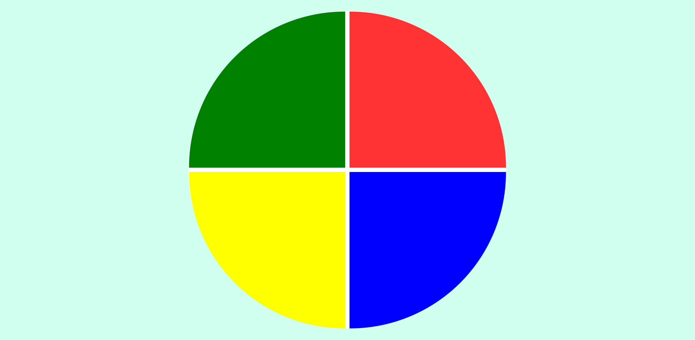
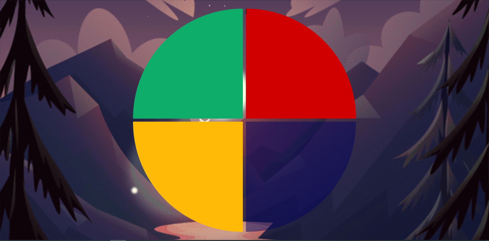

# Jogo da Memória estilo Genius 🙃

Esse é o repositório referente ao projeto "Criando seu jogo de memória estilo Genius" do bootcamp da Eduzz em parceria com a Digital Innovation One.

Neste projeto criamos um jogo da memória estilo Genius com HTML, CSS e Javascript.

Em relação ao projeto original eu modifiquei: 

1-  O plano de fundo, inserindo uma animação de paisagem em loop no background. A animação é o arquivo Valley-sunset.gif

2 - Alterei os tons das cores dos botões do jogo(verde, vermelho, amarelo e azul) no arquivo CSS para tonalidades mais adequadas ao novo plano de fundo. 

3 - Removi os espaços em branco correspondentes a divisão entre os botões, visualmente os botões ficaram mais adequados ao novo plano de fundo.

Abaixo temos o projeto original e o modificado.

Original:

Modificado no projeto:

Animação:

## 🚀 Let's game! 🚀
